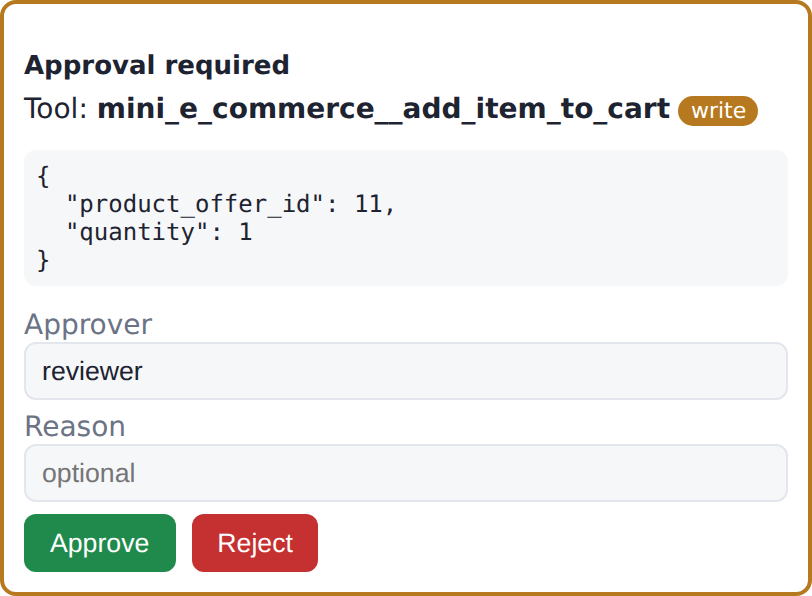
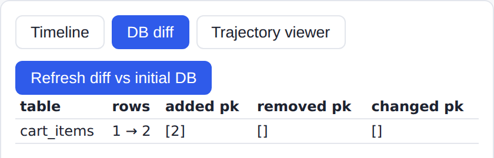
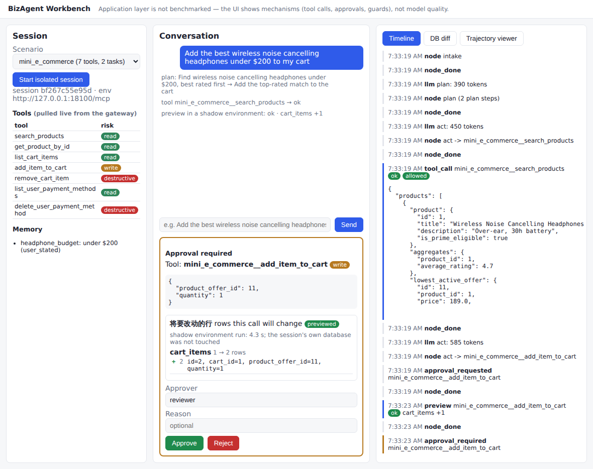
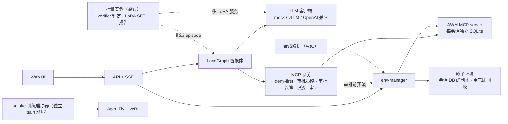

# BizAgent Workbench

[](https://github.com/INF-NAN/BizAgent/actions/workflows/ci.yml?query=branch%3Amain)
[](https://github.com/INF-NAN/BizAgent/actions/workflows/docker-smoke.yml?query=branch%3Amain)

> BizAgent Workbench is an application and engineering layer around Snowflake-Labs/agent-world-model (AWM) and Agent-One-Lab/AgentFly.
> It runs an isolated AWM MCP environment per session and routes every tool call through a deny-first MCP gateway: ordered approval rules decide each call, the shipped default auto-approves nothing, and a write that needs a person is first previewed in a throwaway shadow environment, then approved with a one-time token and audited.
> A LangGraph agent, an HTTP/SSE API and a small web UI drive the environments; the repo also orchestrates AWM's synthesis pipeline and launches smoke-only training in a separate environment.
> Everything runs on CPU with a scripted mock LLM; OpenAI-compatible endpoints and vLLM plug in through configuration.
> A batch lab (`workbench lab`, one script on one GPU) runs the whole stack on official tasks with scenario-level splits and the official code verifiers: base-model evaluation, teacher distillation vs. verifier-filtered rejection sampling, tool-output injection against three gateway configurations, serving benchmarks on recorded agent traffic, and a verifier-free failure predictor.
> Numbers in the docs come from two places only: paper numbers from `results/registry.yaml`, and the lab's own measurements from the committed report of a full run, `results/lab/REPORT.md` (analysis: `docs/LAB_RESULTS.md`). On held-out scenarios, LoRA SFT on verified teacher trajectories took Qwen3-4B-Instruct-2507 from 221 to 264 of 600 test tasks (paired McNemar p = 1.183e-05).

把 AWM 的合成 MCP 环境组织成一个可部署、可审计、可演示的企业智能体工作台：环境隔离、工具治理、智能体、API 与 UI、合成与训练的工程化封装；并在官方任务上批量评测与训练小模型（教师蒸馏、拒绝采样 LoRA SFT、注入攻防、推理服务压测），结果以配对统计报告。

## 功能亮点

- 会话级环境隔离：每个会话一份独立的 SQLite 与一个 AWM MCP server 子进程，按进程组启动与回收，支持快照、恢复与表级 diff。
- deny-first 网关：会话注册时确定工具允许清单，之后出现的工具一律拒绝；风险按工具名动词分级，并以路由的 HTTP 方法为下限。
- 可配置的审批策略：`configs/approval_policy.yaml` 中的规则按顺序匹配工具名、场景、风险级别与参数，决策为 `auto_approve`、`require_human` 或 `deny`；destructive 调用在代码中被保证永远不会自动批准。
- 审批前影子预演：需要人工审批的写操作先在会话数据库的副本上执行一次，审批卡片列出将要改动的行；批准后按结构比对真实改动与预演。
- 一次性审批令牌：HMAC 令牌绑定会话、工具、参数摘要与预演 digest，用一次即作废。
- 限流与审计：令牌桶限流；每次调用写入 JSONL 审计（PII 脱敏），附命中的审批规则与改动比对结果。
- LangGraph 智能体：intake → plan → act → preview → approve → observe → verify → respond，带步数、重复调用、无变化、token 预算与墙钟守卫；长期记忆只接受可追溯来源。
- HTTP/SSE API 与 Web UI：会话、对话、审批卡片、时间线、DB diff 与 AWM 轨迹查看器；网关同时作为 MCP server 对外提供。
- 合成流水线编排：编排 `awm gen` 各步骤，带 checkpoint 续跑、LLM 本地代理（缓存、重试、账本）、预算熔断、中断回收与校验报告。
- 训练启动器：preflight 与 smoke 训练在独立的 train 环境中以子进程运行，训练进程只拿白名单环境变量，产物标记 `NO_RESULTS`。
- 批量实验：官方任务上的场景级划分与 verifier 判定、pass@k、教师蒸馏与拒绝采样自提升的 LoRA 训练、工具结果注入的攻防、真实智能体流量的推理服务压测、无 verifier 的失败预测；一条命令跑完，配对统计出报告（设计见 [docs/EXPERIMENTS.md](docs/EXPERIMENTS.md)，一次完整运行的结果见 [docs/LAB_RESULTS.md](docs/LAB_RESULTS.md)）。

## 截图

<p>
  
  
</p>

左：写操作 `add_item_to_cart` 的审批卡片，写明审批策略的判定（演示策略中没有规则命中，write 默认交人工审批）与影子环境预演出的将要改动的行。右：批准后与初始数据库比较的 DB diff，`cart_items` 新增一行。



整页：对话、带预演 diff 的审批卡片与时间线，时间线中的 `preview` 一项即影子环境预演。截图由 `scripts/demo_ui_check.py` 在 `make demo-mock` 上生成，回答来自手写的 mock 脚本，不是模型输出。

## 架构



分层图、一次带审批的写操作的时序图与智能体状态机见 [docs/ARCHITECTURE.md](docs/ARCHITECTURE.md)。

## 快速开始（mock，CPU）

前置：Linux 或 macOS、`git`、[uv](https://docs.astral.sh/uv/)、Python 3.12（uv 可自动安装）。

```bash
git clone https://github.com/INF-NAN/BizAgent.git && cd BizAgent
make setup        # 初始化两个顶层子模块，安装 app 环境，生成迷你夹具，校验 train 锁文件
make doctor       # 缺少官方数据集或 GPU 只给出 warn
make test         # 单元 + 集成测试（真实 AWM 代码 + mock LLM）
make demo-mock    # 打开 http://127.0.0.1:8080/ui/
```

在 UI 中：Start isolated session → 发送 "Add the best wireless noise cancelling headphones under $200 to my cart" → 审批卡片列出预演出的将要改动的行，点 Approve → 查看 Timeline 与 DB diff（`cart_items` 新增一行）。mock 的回答来自手写脚本 `tests/fixtures/trajectories/demo_query_write_approve.jsonl`。

同样的流程也可以在命令行运行：

```bash
WORKBENCH_LLM__MOCK_FIXTURE=tests/fixtures/trajectories/demo_query_write_approve.jsonl \
uv run workbench agent run --scenario mini_e_commerce --dataset-dir tests/fixtures/awm_mini --approve auto \
  "Add the best wireless noise cancelling headphones under \$200 to my cart"
```

### Docker

需要 Docker 与 Compose v2，检出目录中不能已有 `./data` 与 `.env`：

```bash
python3 scripts/docker_smoke.py   # 构建 → 启动 env-manager 与 app → 经 HTTP API 走一遍上面的演示 → 停止
```

`docker-compose.yml` 定义 `env-manager`、`app` 两个服务，`gpu` profile 另加 `vllm`。GitHub Actions 的 docker-smoke 任务在每次 push 到 `main` 与每个以 `main` 为目标的 PR 上运行这条命令。镜像内含 AWM 代码，只在本地和 CI 构建，不推送到任何镜像仓库（见[上游与致谢](#上游与致谢)）。

## 审批策略

网关在每次工具调用时按 `approval.policy_file` 指定的策略判定。规则按文件顺序匹配，第一条命中的规则决定：

- `require_human`：先在影子环境预演，再由人在审批卡片上批准；卡片写明命中的规则，没有命中时显示 default。
- `auto_approve`：网关以 `policy:<规则编号>` 签发一次性令牌，不预演、不弹卡片，执行后照常测量实际改动并写入审计。
- `deny`：网关直接拒绝，带着令牌也拒绝。

没有命中任何规则时，write 与 destructive 需要人工审批，read 直接放行。destructive 调用不会被自动批准：加载时拒绝这样的规则，匹配时跳过，网关签发令牌前再检查一次。

仓库提供两份策略文件：

- `configs/approval_policy.yaml`：默认策略，不自动批准任何调用。两条规则：禁止删除已保存的支付方式（deny），单次加购超过 5 件交人工（require_human）。自动批准的规则只以注释示例的形式出现，需要管理员显式开启。
- `configs/approval_policy.demo.yaml`：演示策略，在上面两条之外加一条"官方 e-commerce 场景中单次加购不超过 2 件自动批准"，三种决策各一例。`make demo-mock`、docker-smoke 与相关测试使用它；迷你演示场景的加购不命中任何规则，仍然走预演与审批卡片。

`GET /healthz` 的 `approval_policy` 字段给出当前生效的文件与规则。策略文件在网关启动时按 schema 校验，未知字段、类型错误或重复的规则编号会逐条报出。

`workbench gateway policy test` 离线给出一次调用会命中哪条规则，不运行任何东西。同一个官方场景的加购 2 件，在默认策略下交人工，在演示策略下自动批准：

```bash
uv run workbench gateway policy test \
  --tool e_commerce_33__add_item_to_cart --risk write --args '{"product_offer_id": 1, "quantity": 2}'
# decision: require_human (default) - no rule matched: write calls need a human by default

uv run workbench gateway policy test --policy configs/approval_policy.demo.yaml \
  --tool e_commerce_33__add_item_to_cart --risk write --args '{"product_offer_id": 1, "quantity": 2}'
# decision: auto_approve (rule small-cart-add-official) - rule small-cart-add-official: On the official
# e-commerce scenarios, adding up to 2 units is approved automatically.
```

输出还会逐条列出每条规则是否命中及原因，以及这个决策在运行时意味着什么。设计依据见 ADR-027，预演见 ADR-026。

## 接入真实模型

LLM 后端由 `llm.backend` 选择：`mock_replay`（默认）、`openai_compat` 或 `vllm`。所有配置都可以用 `WORKBENCH_<SECTION>__<KEY>` 环境变量覆盖。本地运行时把 `.env.example` 复制为 `.env` 再填写，`.env` 不入库；`WORKBENCH_*` 变量由配置加载器从 `.env` 读取，其余变量（key、AWM 与 Hugging Face 设置）需要导出到 shell 环境，例如 `set -a; . ./.env; set +a`。

OpenAI 兼容后端只需要环境变量，key 从 `WORKBENCH_LLM__API_KEY_ENV` 指定的变量中读取：

```bash
export WORKBENCH_LLM__BACKEND=openai_compat WORKBENCH_LLM__BASE_URL=https://api.deepseek.com \
       WORKBENCH_LLM__MODEL=deepseek-flash WORKBENCH_LLM__API_KEY_ENV=DEEPSEEK_API_KEY
export DEEPSEEK_API_KEY=...
uv run workbench doctor        # llm 一项检查端点是否可达
```

[docs/examples/e-commerce-33-deepseek.md](docs/examples/e-commerce-33-deepseek.md) 记录了用 DeepSeek 在官方 `e_commerce_33` 上跑通的一次端到端运行：规划、读工具、两次审批后的写工具、回答与 DB diff，以及上游 `awm agent` / `awm verify` 的链路。

`.env.example` 中的变量：

| 变量 | 作用 |
|---|---|
| `WORKBENCH_LLM__BACKEND`、`WORKBENCH_LLM__BASE_URL`、`WORKBENCH_LLM__MODEL` | 智能体使用的后端、端点与模型 |
| `WORKBENCH_LLM__API_KEY_ENV` | 保存 key 的环境变量名（例如 `DEEPSEEK_API_KEY`）；key 本身只从这个变量读取 |
| `WORKBENCH_LLM__MAX_TOKENS`、`WORKBENCH_AGENT__TOKEN_BUDGET` | 单次调用的输出上限（默认 8192，含思考 token）与整次运行的 token 预算（默认 240000） |
| `WORKBENCH_APPROVAL_SECRET` | 审批令牌与预演记录的签名密钥；不设置时每次启动随机生成，重启后挂起中的审批需要重新发起 |
| `OPENAI_API_KEY`、`OPENAI_BASE_URL` | 合成流水线与 `workbench verify --mode sql` 的上游 LLM 端点；真实 key 只留在 workbench 进程的本地代理中，AWM 子进程只拿占位 key |
| `AWM_SYN_OVERRIDE_MODEL` | 交给 AWM gen 步骤的模型名，也是 sql 模式裁判的默认模型 |
| `EMBEDDING_OPENAI_API_KEY` | 运行 `gen scenario` 时必须设置（该步骤调用 embedding 端点）；用 `--scenario-file` 跳过该步骤时不需要 |
| `HF_TOKEN` | 可选，下载数据集时使用 |

vLLM 服务 Arctic-AWM 的方式（serving profile、`workbench serve vllm-cmd`、`workbench serve probe`、`docker compose --profile gpu up`）与 smoke 训练见 [docs/DEPLOYMENT.md](docs/DEPLOYMENT.md)。

## 批量实验

`workbench lab` 把整条链路放到官方任务上批量运行，每个 episode 用官方 pure-code verifier 判定。一台单卡机器上一条命令跑完全部实验（[docs/EXPERIMENTS.md](docs/EXPERIMENTS.md)）：

```bash
export DEEPSEEK_API_KEY=...
nohup bash scripts/lab/run_all.sh > data/lab/run.log 2>&1 &
```

- 场景级 train / val / test 划分：test 场景从不出现在训练数据里。
- verifier 下限：让智能体什么都不做，找出 verifier 误判为成功的任务，比较时另给去掉它们的结果。
- 4B 基座模型的单次成功率、pass@k 与失败分类。
- 两种训练数据，训练、选择流程相同，在 test 上与基座和彼此配对比较：
  - 教师蒸馏；
  - 加入学生自身成功轨迹的拒绝采样。

  另有不经 verifier 过滤的消融，用 `SFT_VARIANTS` 打开。
- 工具结果注入：三种网关配置，以及训练前后的模型对比。
- 用录制的真实智能体请求压测 vLLM：前缀缓存与多 LoRA 服务。
- 不运行 verifier、只凭运行时信号的失败预测（按场景分组交叉验证）。

阶段可断点续跑，最后生成 `data/lab/REPORT.md`。

一次完整运行的报告提交在 [results/lab/REPORT.md](results/lab/REPORT.md)，分析见 [docs/LAB_RESULTS.md](docs/LAB_RESULTS.md)。test 的 600 个任务来自训练从未见过的场景；非平凡任务指排除了"什么都不做也被 verifier 判为成功"的任务。配对比较的结果：

| 模型 | 全部 600 个任务 | 非平凡 497 个任务 |
|---|---|---|
| base（Qwen3-4B-Instruct-2507） | 36.8% | 25.8% |
| 教师蒸馏 LoRA SFT | 44.0% | 35.2% |
| 拒绝采样 LoRA SFT | 41.7% | 32.4% |

教师蒸馏相对 base 的差为 7.2%（配对 bootstrap 95% 区间 [4.0%, 10.3%]，McNemar p = 1.183e-05），非平凡任务上为 9.5%。注入实验中，策略层拒绝 destructive 调用把被诱导的执行从 7.5% 降到 0.0%，任务成功率不变；回放真实智能体流量时，前缀缓存的命中率为 69.1%。

## 项目结构

```text
.
├── src/workbench/
│   ├── envs/            # env-manager：会话隔离、进程组、快照与 diff、影子预演、场景目录
│   ├── gateway/         # MCP 网关：风险分级、审批策略、令牌、限流、审计、错误归一
│   ├── agent/           # LangGraph 智能体：节点、守卫、记忆、版本化 prompt
│   ├── llm/             # LLM 客户端：mock replay、OpenAI 兼容、vLLM 命令与探针
│   ├── api/             # FastAPI + SSE，挂载网关 MCP 与静态 UI
│   ├── obs/             # trace（JSONL）与 Prometheus 指标
│   ├── synth/           # 合成编排：checkpoint、LLM 代理、账本、预算熔断、校验
│   ├── train/           # 训练 profile 约束、preflight、launch
│   ├── results/         # 论文数字 registry、RESULTS.md 生成、数字守卫
│   ├── lab/             # 批量实验：划分、运行与验证、录制、注入、SFT 数据、服务压测、统计与报告
│   ├── cli.py           # `workbench` 命令行
│   ├── config.py        # 配置（configs/app.yaml + 环境变量）
│   ├── doctor.py        # 环境自检
│   ├── runtime.py       # 组件装配
│   ├── subprocess_env.py# 子进程与训练进程的环境变量白名单
│   └── verify.py        # `workbench verify`
├── ui/                  # 静态 Web UI，无构建步骤
├── configs/             # 应用配置、工具与审批策略、serving profile、价格表、训练 profile、实验策略
├── scripts/             # 数据下载、vLLM 启动、Docker 冒烟、UI 自检、链接检查、预演计时、日志脱敏；lab/ 为批量实验
├── tests/               # 单元与集成测试；fixtures/ 为手写迷你场景与 mock 脚本
├── results/registry.yaml# 论文数字的唯一来源
├── results/lab/         # 批量实验一次完整运行的报告与 summary.json
├── train/               # 独立的 train 环境（pyproject + uv.lock）
├── third_party/         # AWM 与 AgentFly 子模块（固定 SHA，只读）
├── docs/                # 架构、决策记录、上游、学习路线、部署、实验设计与结果、示例、截图
├── Dockerfile
└── docker-compose.yml
```

## 开发与测试

| 命令 | 作用 |
|---|---|
| `make setup` | 初始化子模块、安装 app 环境、生成迷你夹具、校验 train 锁文件 |
| `make lint` | 相对链接检查、`ruff check`、`ruff format --check`、`mypy --strict` |
| `make test` | 全部测试（`make test-unit`、`make test-integration` 分开运行） |
| `make check-numbers` | 校验 registry，并扫描 README 与 docs 中既不在 registry、也不在实验报告中的性能类数字 |
| `make results` | 由 `results/registry.yaml` 重新生成 `docs/RESULTS.md` |
| `make doctor` | 检查 Python、子模块、数据集、端口、GPU、环境变量与 LLM 后端 |
| `make data` | 下载官方数据集到 `data/awm1k/`（不入库） |
| `make train-lock` | 重新锁定 train 环境 |
| `make clean` | 删除缓存目录 |

集成测试启动真实的 AWM server 子进程，只用 CPU 与 mock LLM。标记为 `official_data` 的测试需要 `make data` 下载的官方数据集，没有数据时自动跳过。`uv run pre-commit install` 安装提交前检查：ruff、detect-secrets，以及子模块不得有改动。CI 在每次 push 与 PR 上运行 lint、secrets、test、check-numbers 与 doctor。

学习路线见 [docs/WALKTHROUGH.md](docs/WALKTHROUGH.md)，架构决策见 [docs/DECISIONS.md](docs/DECISIONS.md)，上游接口与行号见 [docs/UPSTREAM.md](docs/UPSTREAM.md)。

## 设计边界

- 应用层功能（网关、审批、守卫）不做效果统计，小规模的自建任务不足以支撑效果结论。官方任务上的批量实验有单独的设计（场景级划分、官方 verifier 判定、配对比较，ADR-028），运行记录留在不入库的 `data/lab/`，一次完整运行生成的报告提交在 `results/lab/`。论文报告的数字只登记在 `results/registry.yaml`，由它生成 [docs/RESULTS.md](docs/RESULTS.md)；`make check-numbers` 要求 README 与 docs 中的性能类数字来自 registry 或这份实验报告，并拦截应用层效果措辞。测试证明的是机制按设计工作，例如写操作一定经过审批、令牌只能用一次、守卫会终止循环（ADR-013）。
- AWM 没有许可证，本仓库只以 submodule 指针引用它，不复制、不打补丁。Docker 镜像内含 AWM 代码，所以只在本地和 CI 构建，不推送到镜像仓库（ADR-003）。
- AgentFly / veRL 的 RL 训练只提供 smoke 配置。上游公开了环境适配，没有公开完整的训练配方，所以 smoke 只演示 AgentFly 自带的"rollout → 奖励 → 更新"链路，使用 `calculator` 工具与数学奖励，不接触 AWM 环境，模型不超过 1.7B、LoRA、不超过 5 step，产物标记 `NO_RESULTS`（ADR-012）。批量实验在 AWM 任务上的 LoRA SFT 由单独的脚本 `scripts/lab/sft_train.py` 完成，不经过 AgentFly（ADR-028）。
- 自合成的环境只放在 `data/synth/`，manifest 标记 `origin: local-synth`，不与官方数据混合，也不用于训练（ADR-011）。
- 风险分级与"空结果"判定是启发式的。以 GET 实现的写操作无法按方法识别，以 POST 实现的纯查询会要求审批；`configs/tool_policy.yaml` 的 `overrides` 与 `workbench gateway export-risk` 导出的表用于人工复核（ADR-006、ADR-007）。
- 上游生成代码的语义缺陷网关无法识别，例如官方环境接受不存在的 offer ID 并成功写入。这类问题靠审批与 DB diff 暴露，默认策略因此不自动批准任何调用（ADR-027）。
- 审批前预演是结构比对：比对改动的表、主键与列名，时间列只记录不比对；预演会把生成的代码多执行一次，每次审批多等一次影子 server 启动（ADR-026）。审批策略只看调用本身，不看数据库状态，策略文件在网关启动时加载（ADR-027）。
- 执行生成代码的子进程只拿白名单中的环境变量，隔离止于环境变量：子进程与 workbench 以同一用户运行，仍能读取该用户可读的文件。`awm verify` 在同一进程里执行 verifier 代码，只有经 `workbench verify` 运行时才拿不到真实 key（ADR-017、ADR-023、ADR-024）。
- 部署是单进程的：审批令牌的已使用集合、限流桶、忙碌会话集合与 `reasoning_content` 记录都在进程内存中，多副本部署需要共享存储。

## 上游与致谢

| 上游 | 位置 | 用途 | 许可证 |
|---|---|---|---|
| [Snowflake-Labs/agent-world-model](https://github.com/Snowflake-Labs/agent-world-model) | `third_party/agent-world-model` @85e322f | 环境建库、MCP server、合成 CLI | 无 |
| [Agent-One-Lab/AgentFly](https://github.com/Agent-One-Lab/AgentFly) | `third_party/AgentFly` @1256586 | 只在独立的 train 环境中使用 | Apache-2.0 |
| Agent-One-Lab/verl（AgentFly 嵌套的 veRL fork） | 默认不初始化 | smoke 训练 | Apache-2.0 |
| HF 数据集 Snowflake/AgentWorldModel-1K | `make data` 下载到 `data/awm1k/`，不入库 | 官方场景 | CC-BY-4.0 |
| HF 模型 Snowflake/Arctic-AWM-4B/8B/14B | 不入库，vLLM 运行时下载 | 模型服务 | Apache-2.0 |
| HF 模型 Qwen/Qwen3-4B-Instruct-2507 | 不入库，批量实验下载到 `data/models/` | 批量实验的基座与学生模型 | Apache-2.0 |
| DeepSeek API | 外部服务 | 批量实验的教师模型 | 服务条款 |

上游只以固定 SHA 的 submodule 引用，本仓库没有修改过任何上游文件。文件级边界、许可证细节与上游接口见 [docs/UPSTREAM.md](docs/UPSTREAM.md)。

### 许可证

本仓库自有代码按 [MIT](LICENSE) 授权，版权人 Yueyi Li。MIT 只覆盖本仓库自有的文件（`src/workbench/`、`tests/`、`scripts/`、`configs/`、`ui/` 与文档等，清单见 UPSTREAM §2.2），下列内容各按各自的条款：

- AWM 没有许可证。本仓库只以 submodule 指针引用它，不对 AWM 代码授予任何权利，使用前请自行判断（ADR-003）。
- AgentFly 与其嵌套的 veRL 为 Apache-2.0。
- Arctic-AWM-4B/8B/14B 与 Qwen3-4B-Instruct-2507 为 Apache-2.0。批量实验的教师轨迹来自 DeepSeek API 的输出，用它们训练模型前请确认 DeepSeek 的服务条款。
- AgentWorldModel-1K 为 CC-BY-4.0；仓库中摘自该数据集的内容（`docs/examples/` 中的工具清单与运行记录、`tests/fixtures/awm_mini/` 借用的工具名与参数名）同样按 CC-BY-4.0。

数据集与模型权重都不入库，只提供下载方式。

### 数据集署名（CC-BY-4.0）

AgentWorldModel-1K，作者 Zhaoyang Wang, Canwen Xu, Boyi Liu, Yite Wang, Siwei Han, Zhewei Yao, Huaxiu Yao, Yuxiong He；配套论文 *Agent World Model: Infinity Synthetic Environments for Agentic Reinforcement Learning*（arXiv:2602.10090）；链接 https://huggingface.co/datasets/Snowflake/AgentWorldModel-1K ；许可证 [CC-BY-4.0](https://creativecommons.org/licenses/by/4.0/)。本仓库不分发、不修改该数据集，改动说明见 [docs/UPSTREAM.md](docs/UPSTREAM.md) §5。
